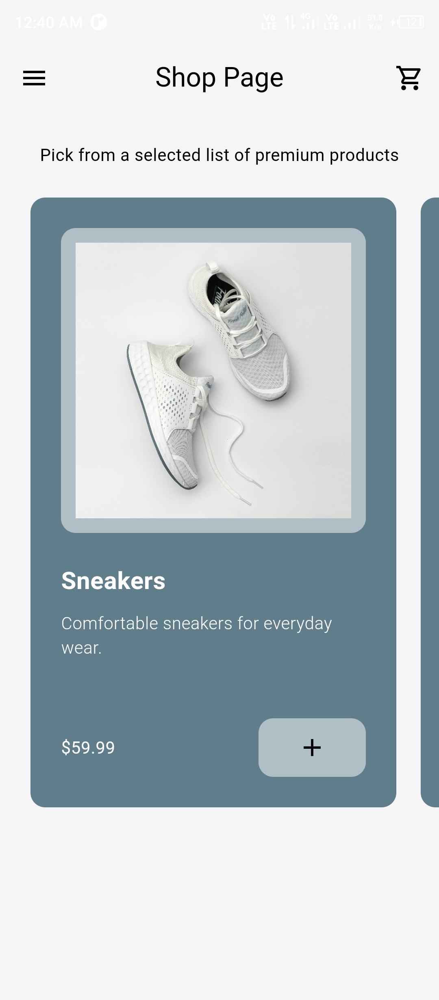
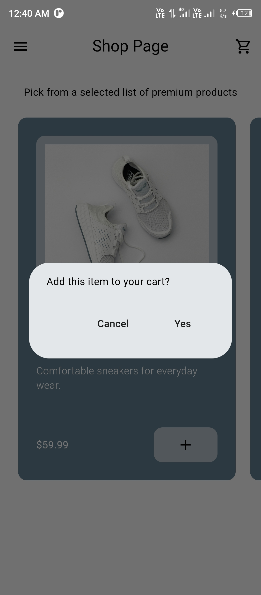
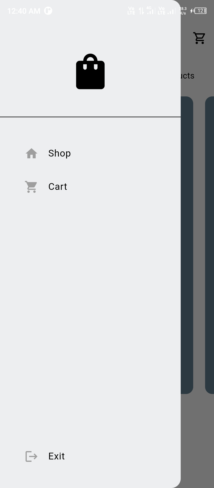
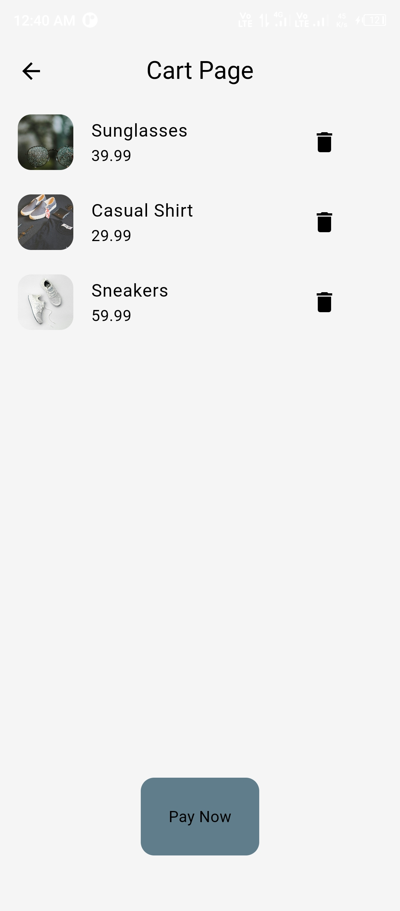

# eCommerce App

Welcome to the eCommerce App repository! This Flutter application is designed to provide users with an intuitive and engaging online shopping experience. Users can browse products, add items to their cart, and make purchases seamlessly. This README provides an overview of the project, installation instructions, and other relevant details.

## Table of Contents

- [Overview](#overview)
- [Features](#features)
- [Screenshots](#screenshots)
- [Installation](#installation)
- [Usage](#usage)
- [Contributing](#contributing)
- [License](#license)

## Overview

The eCommerce App is built using the Flutter framework, offering cross-platform compatibility for both iOS and Android devices. It leverages various Flutter packages and follows best practices to create a smooth and visually appealing shopping experience for users.

## Features

### Current Features

1. **Product Listing**: Display a list of available products for users to browse.
2. **Shopping Cart**: Allow users to add products to their cart for later purchase.
3. **Cart Management**: Enable users to view, edit, and remove items from their shopping cart.
4. **Dark/Light Theme**: Provide users with the option to switch between dark and light themes for optimal viewing.

### Future Features

1. **User Authentication**: Implement user authentication for secure logins and personalized experiences.
2. **Product Categories**: Organize products into categories for easier navigation.
3. **Search Functionality**: Allow users to search for specific products by name or category.
4. **Payment Integration**: Integrate payment gateways for seamless checkout experiences.
5. **Order History**: Enable users to view their past orders and order details.

## Screenshots







## Installation

To run the eCommerce App locally on your machine, follow these steps:

1. **Clone the Repository**: Clone this GitHub repository to your local machine using the following command:

   ```bash
   git clone https://github.com/zahidprvz/ecommerce_app.git
   ```

2. **Navigate to the Project Directory**: Change your directory to the project folder:

   ```bash
   cd ecommerce_app
   ```

3. **Install Dependencies**: Use Flutter's package manager, `pub`, to install the project dependencies:

   ```bash
   flutter pub get
   ```

4. **Run the App**: Launch the app on a connected device or emulator using Flutter's `run` command:

   ```bash
   flutter run
   ```

## Usage

Once the app is running on your device or emulator, you can interact with it just like any other mobile application. Use the navigation buttons to browse products, add items to your cart, and make purchases. Additionally, you can explore different features and settings, such as theme customization and account management.

## Contributing

Contributions to the eCommerce App project are welcome! If you encounter any issues, have feature requests, or would like to contribute code, feel free to open an issue or submit a pull request on GitHub. Please follow the contribution guidelines outlined in the repository.

## License

This project is licensed under the [MIT License](LICENSE), which means you are free to use, modify, and distribute the code for personal or commercial purposes. See the `LICENSE` file for more details.
